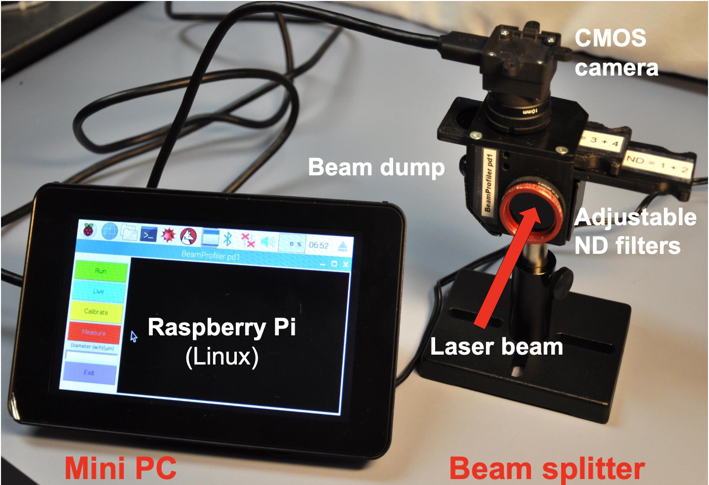
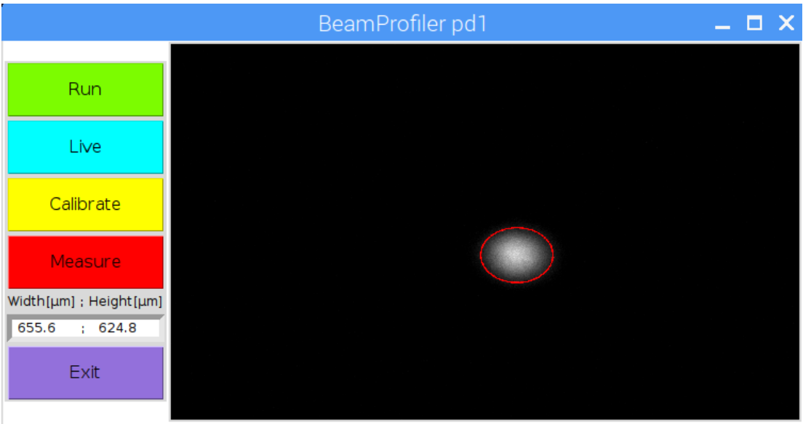

# BeamProfiler pd©

The BeamProfiler pd1© allows to measure laser beams with diameters up to 4 mm. It is controlled by a Raspberry Pi, a small single-board computer with an adapted 7” touch display.

| Camera parameter           | Laser beam                | BeamProfiler results              |
| -------------------------- | ------------------------- | --------------------------------- |
| Sensor Size: 5,7 x 4,28 mm | Beam diameter: up to 4 mm | Beam diameter $ \frac{1}{e^2} $ |
| Pixel: 2592 x 1944         | Wavelength: 350 – 950 nm | Width and height                  |
| Pixel Size: 2,2 x 2,2 µm  |                           | Image with scale                  |

For more information see also: `BeamProfiler-pd1_manual.pdf`

©Dirk Müller, JanPhilipp Praetorius




## Assembly of the Raspberri Pi

### Install heat sinks one the Pi

[raspberrytips](https://raspberrytips.com/install-heat-sinks-raspberry-pi/)

### Setting up your Raspberry Pi

[https://projects.raspberrypi.org/en/projects/raspberry-pi-setting-up](https://projects.raspberrypi.org/en/projects/raspberry-pi-setting-up)

1. insert SD-card
2. connect the mouse to a USB-port
3. connect a keyboard to a USB-port
4. connect a screen via HDMI
5. connect power supply to micro-USB(the Pi starts to boot)

### Finish Setup

6. select corresponding settings

## Installation

### Install miniconda

run as bash command:

```bash
wget http://repo.continuum.io/miniconda/Miniconda-3.16.0-Linux-armv7l.sh
```

### Install python3 with

corresponding libraries on the Pi

7. [OpenCV]([https://tutorials-raspberrypi.de/opencv-auf-dem-raspberry-pi-installieren/](https://tutorials-raspberrypi.de/opencv-auf-dem-raspberry-pi-installieren/))

[fhttps://www.alatortsev.com/2018/09/05/installing-opencv-3-4-3-on-raspberry-pi-3-b/](https://www.alatortsev.com/2018/09/05/installing-opencv-3-4-3-on-raspberry-pi-3-b/)

OR

```bash
sudo apt install python3-opencv
```

Access via
ssh: [https://www.raspberrypi.org/documentation/remote-access/ssh/](https://www.raspberrypi.org/documentation/remote-access/ssh/)

8. install matplotlib

```bash
sudo pip3 install matplotlib
```

9. if numpy must be updated

```bash
sudo pip3 install –upgrade numpy
```

10. install PIL.ImageTk

```bash
sudo apt-get install python3-pil.imagetk
```

11. follow installation instruction for camera-library: [https://github.com/basler/pypylon](https://github.com/basler/pypylon)

11.1     download pylon-software for OperatingSystem: *ARM-32-bit:*

https://github.com/Basler/pypylon/releases:

install corresponding lib :

for python 3.5 install [pypylon-1.3.1-cp35-cp35m-linux_armv7l.whl](https://github.com/basler/pypylon/releases/download/1.3.1/pypylon-1.3.1-cp35-cp35m-linux_armv7l.whl)

```bash
pip3 install pypylon-1.3.1-cp35-cp35m-linux_armv7l.whl
```

11.2 To
commit permission for executing the shell script by double click go to desktop and type:

```bash
chmod u+x BeamProfiler.sh
```

## Connect Pi with Touchscreen

12. Remove screws of controller board at the backside of the display, put Pi on the appropriate screw socket and mount the Pi with the screws
13. Connect the cables from the controller board with the Pi as shown in the following link:

[https://maker-tutorials.com/raspberry-pi-touchscreen-installieren-und-anschliessen-tipps-tricks/](https://maker-tutorials.com/raspberry-pi-touchscreen-installieren-und-anschliessen-tipps-tricks/)

14. Start the Pi and if necessary rotate the display with the following command:

```bash
sudo nano / boot /config.txt
```

and add the following line on the top of the file:

`„lcd_rotate=2“`

15. Save the file and test the shell script **„BeamProfiler.sh“** on the Desktop
